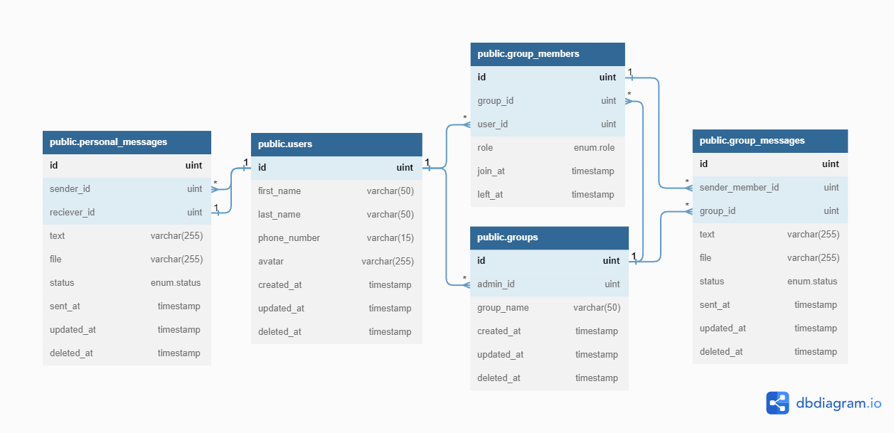

# Table of Contents

-   [Task 1: Find the maximum profit](./max_profit.go)
-   [Task 2: Rotatating Array](./max_profit.go)
-   [Task 3: Design Schema Database](#schema-database)

# Schema Database

Disini saya hanya memberikan nomor telepon sebagai parameter yang digunakan untuk user melakukan login. User akan login dengan OTP Authentication, seperti halnya aplikasi messanger lain seperti whatsapp dan telegram.

Schema Database saya gunakan adalah SQL, karena untuk menyimpan dan mengelola relational data. Pada schema yang sudah dibuat banyak table yang memiliki relasi satu sama lain, contohnya user memiliki relasi ke banyak table seperti users-personal_messages, users-groups, users-group_members, dan table lainnya.

SQL juga berguna ketika membutuhkan query yang menggunakan JOIN yang kompleks dan database SQL memiliki dukungan bawaan untuk transaksi.  

Skema Terdiri dari 5 table yaitu users, personal_messages, groups, group_members, dan group messages.

1. Table Users

    Berisikan informasi pengguna seperti nama, nomor telepon, dan avatar, serta waktu pembuatan, modifikasi, dan deactive account.

2. Table Personal Messages

    Merepresentasikan message 1 on 1 yang dikirim antara dua pengguna. Ini termasuk ID user pengirim dan penerima, isi pesan(teks dan file), dan status pesan(terkirim, terbaca, dan tertunda)

    Pada table ini terdapat dua relasi, yaitu

    - One to Many, dimana kolom sender_id pada table personal messages ini adalah id dari pengirim/pembuat chat dan merefresensi ke kolom id pada table users.
    - One to One, dimana kolom reciever_id pada table personal messages ini adalah user yang dituju dan mereferensi ke kolom id pada table users.

3. Table Groups

    Table ini merepresentasikan grup dalam sistem dan mencakup admin grup, nama grup, waktu pembuatan, modifikasi, dan penghapusan grup.

    Pada table ini terdapat 1 relasi yaitu:

    - One to Many, dimana kolom admin_id pada table ini adalah id dari pembuat/pemilik dari group dan mereferensi ke kolom id pada table users.

4. Table Group Members

    Table ini merepresentasikan anggota setiap grup dan mencakup role mereka(admin/member), waktu untuk bergabung dengan grup, dan keluar grup.

    Pada table ini terdapat 2 relasi yaitu:

    - One to Many, dimana kolom group_id pada table ini adalah id dari group yang telah dimasuki oleh anggota tersebut dan mereferensi ke kolom id pada table groups
    - One to Many, dimana kolom admin pada table ini adalah id dari si pemilik atau si pembuat group d an mereferensi ke kolom id pada table users.

5. Table Group Messages

    Table ini merepresentasikan pesan yang dikirim dalam sebuah grup dan mecakup id member pengirim, id grup, isi pesan(teks/file), dan status pesan(terikirim, terbaca, tertunda). Ini juga mencakup waktu pengiriman pesan, modifikasi, serta penghapusan.

    Pada table ini terdapat 2 relasi yaitu:

    - Many to Many, dimana kolom sender_member_id pada table ini adalah id dari member yang mengirim pesan dan mereferensi ke id pada table group_members.
    - Many to Many, dimana kolom group_id pada table ini adalah id dari group yang menampung pesan ini dan mereferensi ke id pada table groups.
